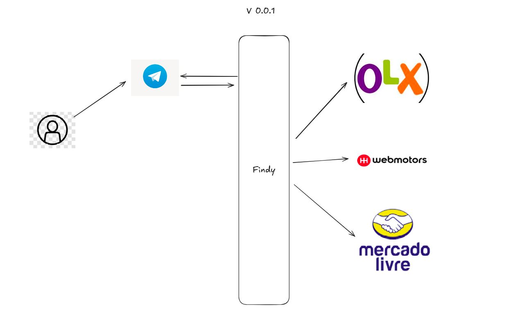

# Findy - Bot de Promoções [cite:3]

## Descrição do Projeto
- Backend Spring Boot multi-módulo para scraping de promoções via gateways.
- Integra WhatsApp/Telegram, RAG com Spring AI e notificações.
- Stack: Java 21, Spring Integration, PostgreSQL, Docker.

## Como Funciona
- Gateway recebe mensagem → Handler (Jsoup/Python) scrape → AI processa → Notifica usuário.
- Exemplo: POST /scrape?site= MagazineLuiza → Retorna JSON com deals.

## Arquitetura
- **Core**: Spring Integration orquestra fluxos.
- **Módulos**: scraper, ai, notifications.
- Diagrama textual: User → Gateway → Handler → DB/AI.

## Entidades
- Promotion: id, price, site, expires.
- User: token, preferences.

## System Design
- Escalável com Docker; cache Redis; security JWT.
- Trade-offs: Monólito inicial para simplicidade.

## Instalação
1. `mvn clean install`
2. `docker-compose up`

## Contribuição
Use CLAUDE.md para instruções AI.

